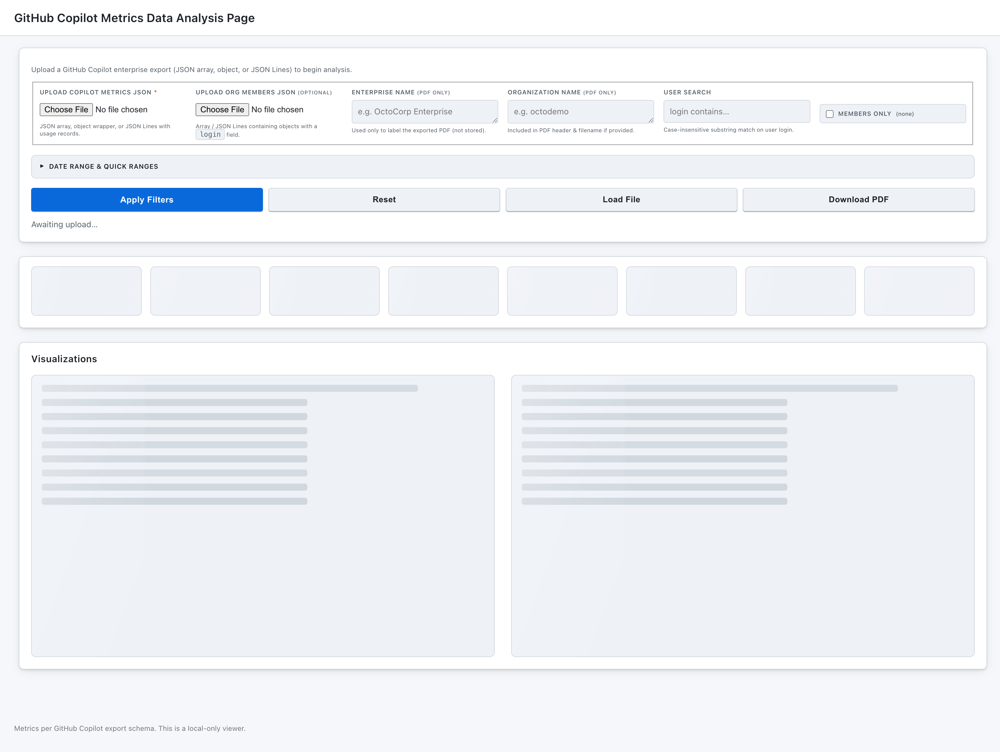
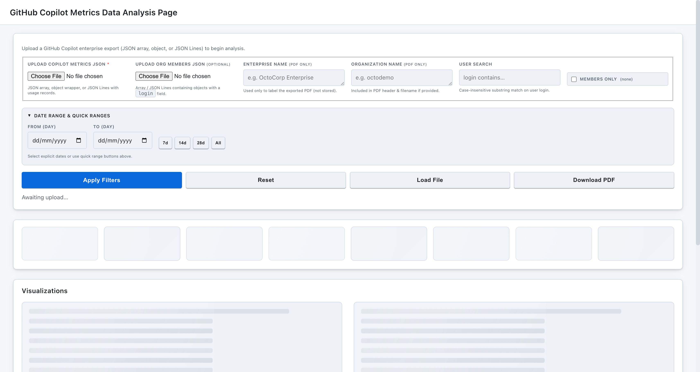
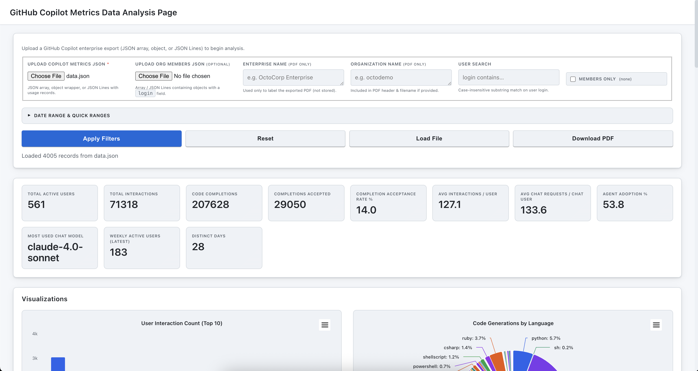

## GitHub Copilot Metrics Analyzer – Usage Guide

This is a local, client‑side dashboard for exploring GitHub Copilot Enterprise usage exports. No data is uploaded to a server: everything stays in your browser.

### 1. Prepare your data
Export your Copilot metrics (enterprise or organization scope) from GitHub.
This can be exported by clicking on download button here. https://github.com/enterprises/{enterprise_slug}/insights/copilot

Optional: export a list of organization members (array or JSON Lines) containing a `login` (or `user_login` / `name`) field to enable the “Members only” filter.
This can be exported by clicking on Export > JSON button here. https://github.com/orgs/{org_name}/people

### 2. Open the dashboard
Just open `index.html` in a modern desktop browser (Chrome, Edge, Firefox, Safari). You can double‑click the file or serve the folder with a simple local web server.

### 3. Load a metrics file
1. Click “Upload Copilot Metrics JSON” and choose your export file.
2. The status message will show progress; once parsed, summary metric cards and charts render automatically.
3. (Optional) Upload the members file to activate the “Members only” checkbox.

Screenshots:

---

---

---

### 4. Use filters & quick ranges
* User Search: type part of a login (case‑insensitive) to narrow results.
* Date Range: set explicit From / To days, or use quick buttons (7d / 14d / 28d / All) for instant ranges.
* Members only: after loading a members file, restrict metrics to those users.
* Apply Filters: re‑computes the summary cards and all charts with current criteria.
* Reset: clears search, date edits, quick‑range selection, and members‑only filter, restoring the full dataset.

### 5. Explore the metrics
Summary cards show totals (active users, interactions, completions, acceptances, acceptance rate, distinct days, weekly active users, chat adoption metrics, and most used chat model). Below them, interactive charts visualize:
* Top users by interaction, completions vs acceptances, acceptance rate %
* Language usage (totals, per day stacked area)
* Model usage (overall, per day, per feature)
* Feature usage, IDE distribution
* Heatmaps (Language × Model, Feature × Model)
* Daily and weekly active users

Hover any chart element for tooltips. Categories auto‑trim if extremely long to preserve readability.

### 6. Generate a PDF report
1. (Optional) Enter Enterprise Name and/or Organization Name (used only for labeling the PDF and filename).
2. Click “Download PDF” after data loads. A multi‑page PDF (summary grid + each chart) is generated entirely in your browser.

### 7. Privacy & local‑only behavior
* Files are read with the File API; contents are not sent elsewhere.
* PDF rendering rasterizes charts locally using Highcharts + html2canvas + jsPDF.
* Reloading the page clears all loaded data.

### 8. Troubleshooting
| Symptom | What to try |
|---------|-------------|
| “Upload parse error” | Ensure valid JSON / JSON Lines; remove comment lines; check for trailing commas. |
| No charts after upload | File may be empty or fields missing required numeric metrics. Verify export source. |
| Members only disabled | Upload a members file with objects containing a login field. |
| Date inputs empty or disabled | Ensure records contain a `day` field (YYYY-MM-DD). |
| PDF button disabled | Load a metrics file first; button enables after successful parsing. |

### 9. Suggested workflow
1. Download latest enterprise metrics export from GitHub.
2. (Optional) Download members list from GitHub Organisation Members page.
3. Open dashboard locally and load metrics file.
4. Apply date + user filters to focus on adoption windows (e.g., last 28 days).
5. Review acceptance, agent adoption %, weekly active users.
6. Export PDF for sharing with stakeholders.

### 10. FAQ
* Does it send data over the network? \
No—network requests are only for public script libraries (Highcharts / jsPDF / html2canvas); your data file never leaves the page.
* Can I bookmark a filtered view? \
State isn’t persisted; reapply filters after reopening.
* Large files? \
Modern browsers handle several MB. Extremely large exports may slow rendering—filter by date to reduce scope.

---
For feature ideas or adjustments, edit `script.js` or `style.css` — no build step required.

