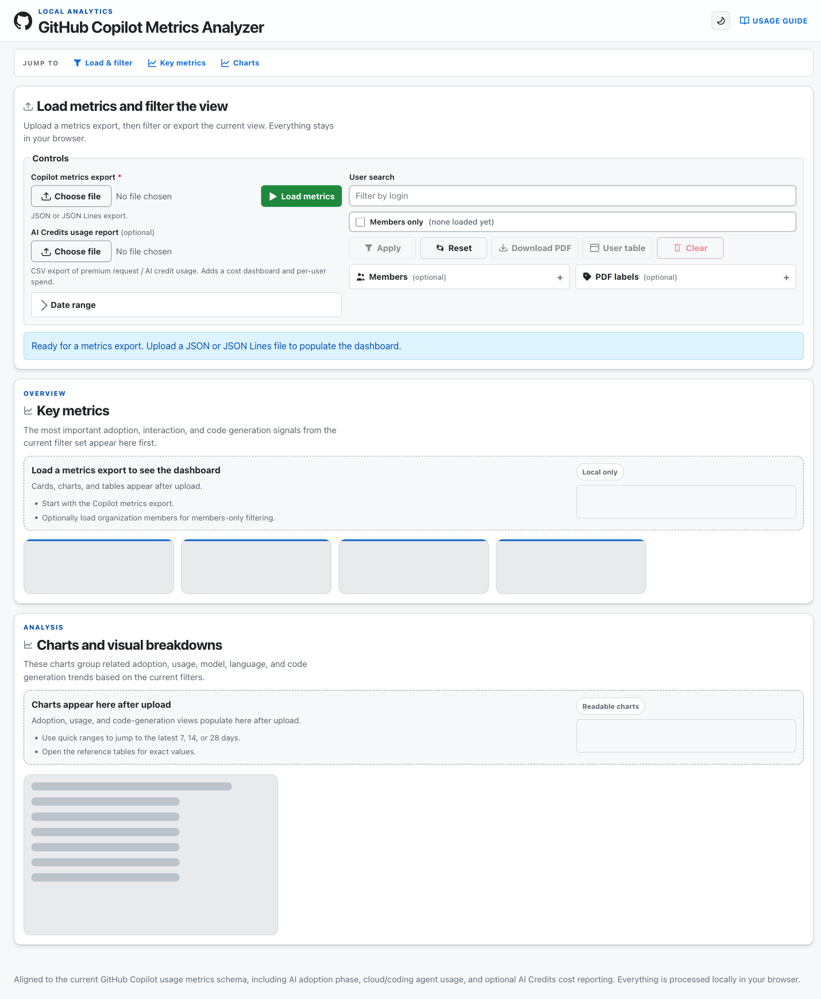
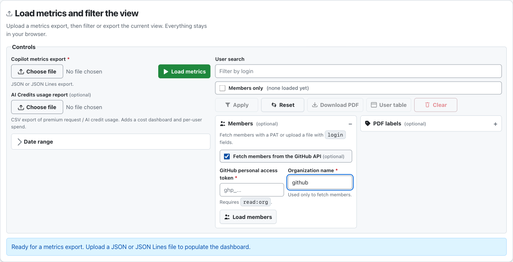
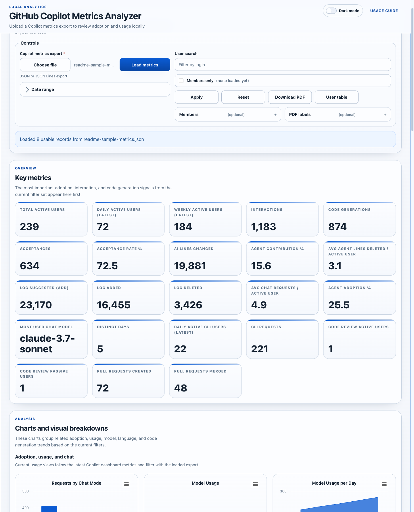

## GitHub Copilot Metrics Analyzer – Usage Guide

**Please note this is not an official solution from GitHub.**

This is a local, client‑side dashboard for exploring GitHub Copilot usage exports. It supports both **local file uploads** and **direct GitHub API integration** for organization members filtering. No data is uploaded to a server: everything stays in your browser. Analysis is organized into page-style views for **Overview**, **Charts**, **AI Credits**, **Reference Tables**, and **Users** while preserving the loaded data in memory.

The dashboard now handles both:
* **User-level records** (for per-user analysis, user flags, and CSV export)
* **Aggregate day totals** from enterprise/org reports (including `day_totals`, CLI metrics, pull request activity, and monthly/daily active user fields)

It is aligned to the latest usage-metrics schema, including per-user **AI Credits used** (`ai_credits_used`), **AI adoption phase** (`ai_adoption_phase`), **Copilot cloud agent** (`used_copilot_cloud_agent`), and **Copilot coding agent** (`used_copilot_coding_agent`) signals.

It also supports an optional **AI Credits usage report (CSV)** upload — the premium-request / AI-credit billing export — which adds a dedicated **"AI Credits & cost"** dashboard section and merges billed credits and cost into the per-user table. All credit views respect the same date, user-search, and members-only filters. 1 AI credit = $0.01.

### Quick Start Options

#### Option 1: Upload + (Optional) API Members Fetch (Recommended Hybrid)
1. Export a Copilot metrics JSON/JSONL file (enterprise or org export)
2. (Optional) Create a PAT with `read:org` scope if you want automatic member list
3. Upload the metrics file
4. (Optional) Enable the "Fetch organization members via GitHub API" checkbox
5. Enter PAT + Organization name then click "Fetch Members" (only members are fetched; metrics stay local)

#### Option 2: File Upload
1. Export your Copilot metrics from GitHub
2. Open the dashboard and select "Upload File" mode  
3. Upload your JSON/JSONL export file
4. Optionally upload organization members file

#### Bundled sample data
Upload [`sample-data.json`](sample-data.json) to explore the dashboard without using a real metrics export. It contains exactly **1,000 synthetic user-day records**: 100 fictional users across 10 days, with varied usage personas, inactive days, multi-feature/model/language activity, AI Credit outliers, CLI and agent workflows, pull requests, code review signals, evolving adoption phases, and LoC metrics. It contains no real user or organization data.

---

### Detailed Instructions

#### Using GitHub API Integration

Hybrid mode: The dashboard no longer downloads metrics via API. You always provide the metrics export file. The GitHub API (if used) is only for retrieving the organization member list to enable the “Members only” filter.

**Step 1 (Optional): Create GitHub Personal Access Token**
Scope: `read:org` (only needed if you want to auto‑fetch members; otherwise skip.)

**Step 2: Access the Dashboard**
Open `index.html` locally or visit: https://abhi-singhs.github.io/copilot-metrics-analysis/

**Step 3: Upload Metrics File**
Upload your Copilot metrics export JSON/JSONL.

**Step 4 (Optional): Fetch Members**
Check the API members toggle, enter PAT + Organization name, click "Fetch Members". Members load; enable the “Members only” filter.

**What happens under the hood (members fetch)**
1. Calls `GET /orgs/{org}/members` to build a Set of logins
2. Updates UI with member count
3. If “Members only” is checked, filters currently loaded metrics immediately

**Telemetry requirement (general)**: Users must have IDE telemetry enabled for their activity to appear in exported metrics.

#### Using File Uploads (Traditional Method)

### 1. Prepare your data
Export your Copilot metrics (enterprise or organization scope) from GitHub.
This can be exported by clicking on download button here. https://github.com/enterprises/{enterprise_slug}/insights/copilot

Supported shapes include JSON arrays, JSON Lines / NDJSON, object wrappers, and enterprise/org responses that contain `day_totals`.

Optional (file mode only): export a list of organization members (array or JSON Lines) containing a `login` field to enable the “Members only” filter.

### 2. Open the dashboard
Just open `index.html` in a modern desktop browser (Chrome, Edge, Firefox, Safari). You can double‑click the file or serve the folder with a simple local web server.\
Or you can navigate to this URL. \
https://abhi-singhs.github.io/copilot-metrics-analysis/

### 3. Choose your data source
The dashboard now supports two data sources:

**GitHub API (Hybrid Members Fetch Only):**
- Does NOT download metrics
- Optional convenience to load org members list
- Requires only `read:org` scope

**File Upload (Traditional):**
- Use exported JSON/JSONL files
- Works offline
- Manual members file upload if needed
- Full control over data scope

### 4. Load data
1. Click “Upload Copilot Metrics JSON” and choose your export file.
2. The status message will show progress; once parsed, the **Overview** page opens automatically and the Load & Filter drawer collapses to a compact file, record-count, date-range, and active-filter summary. Reopen it at any time to change the data or filters.
3. (Optional) Upload the members file to activate the “Members only” checkbox.

Screenshots:

---

---

---

### 4. Use filters & quick ranges
* Dashboard User Filter: type part of a login (case‑insensitive) to narrow metrics across every page.
* Date Range: set explicit From / To days, or use quick buttons (7d / 14d / 28d / All) for instant ranges.
* Members only: after loading a members file, restrict metrics to those users.
* Apply Filters: re‑computes the summary cards and all charts with current criteria.
* Reset: clears search, date edits, quick‑range selection, and members‑only filter, restoring the full dataset.

### 5. Explore the metrics
Summary cards now reflect the latest Copilot usage metrics reference, including active-user rollups, chat usage, AI Credits used, LoC changed with AI, agent contribution, CLI usage, code review activity, and pull request totals when present in the export.

Use the page navigation above the Load & Filter drawer to move between the Overview, Charts, Reference Tables, and Users views without reloading the uploaded data. The AI Credits page appears when an AI Credits usage report is loaded.

The Charts page renders updated chart groups for:
* Adoption, usage, AI Credits used per day, and chat modes (including **AI adoption phase distribution**)
* Model usage (overall, per day, per chat mode, per language)
* Language usage (overall and per day)
* IDE distribution
* Daily / weekly active users and daily active CLI users
* Code generation views: LoC suggested vs changed, daily added/deleted lines, and user-initiated vs agent-initiated changes
* Pull request and Copilot review suggestion activity

When they are present in the export, the summary cards also surface **AI Credits Used**, **Coding Agent Users**, **Cloud Agent Users**, and the **Top Adoption Phase**. User-level exports also add a **Top Users by AI Credits Used** chart.

#### AI Credits & cost (optional)
Enable **Show AI Credits usage report upload** in the controls, then upload the billing CSV to unlock a dedicated **AI Credits & cost** section. It shows:
* Cards for total AI credits, net/gross cost, discounts, users with spend, average credits per user, most expensive model, per-user monthly quota, and overage (when present).
* Charts for credits by model, credits and net cost per day, top users by credits, credits by organization / cost center, and auto- vs manually-selected model credits.
* Tables for credits by model, user, organization, and cost center.

The report can be loaded on its own (cost-only) or alongside a metrics export. When both are loaded, credit spend is merged into the per-user table (see below). The CSV must include at least `date`, `model`, `quantity`, `net_amount`, and `unit_type` columns; models prefixed with `Auto:` are treated as auto-selected.

The `ai_credits_used` value in the metrics JSON is handled independently and does not require the billing CSV. It appears in key metrics, the daily overview and chart, and per-user analysis. When both sources are loaded, the user table distinguishes **AI Credits Used** from the metrics export and **Billed AI Credits** / **AI Credit Cost** from the billing report.

#### Reference tables
The **Reference Tables** page mirrors the newer schema with sortable-by-filter tables for:
* Daily overview values, including AI Credits used when available
* Feature, language, model, and IDE breakdowns
* AI adoption phases
* CLI activity
* Code review activity
* Pull request lifecycle activity

The **AI adoption phases** table includes the v1 meaning for each cohort. Phase classification is based on Copilot surfaces used on at least two days in a rolling 28-day window: **Phase 0 — No cohort**, **Phase 1 — Code first**, **Phase 2 — Agent first**, and **Phase 3 — Multi-agent**.

#### Per-user detail & CSV export
The **Users** page is always available in the page navigation. It shows a clear empty state before upload or when the current export/filter set has no user-level records, and otherwise displays a sortable table of aggregated metrics per user. It includes:
* Interactions, completions, acceptances, acceptance %
* Active days, chat days, agent days, CLI days, and code review days
* Adoption phase, cloud agent days, and coding agent days (when those fields are present)
* CLI requests / sessions
* LoC Suggested (add/delete), LoC Added, LoC Deleted
* **AI Credits Used** per user (when `ai_credits_used` is present in the metrics export)
* **Billed AI Credits** and **AI Credit Cost** per user (when an AI Credits report is loaded alongside embedded usage data)
* Top model, language, feature, IDE, and chat mode

You can:
* Click column headers to sort ascending/descending.
* Search logins live with the search field above the table. This search affects only the Users table, not the Overview, Charts, AI Credits, or Reference Tables pages.
* Page through 25 users by default, or choose 10, 25, 50, or 100 rows per page.
* Export every user matching both the global dashboard filters and the table-local search via **Export CSV**. Export includes all matching pages, not just the visible page.
* Use the global date range, dashboard user filter, and members-only filter to update every page; the Users table refreshes automatically.

Hover any chart element for tooltips. Categories auto‑trim if extremely long to preserve readability.

### 6. Generate a PDF report
1. (Optional) Enter Enterprise Name and/or Organization Name (for labeling only; not used for API fetch now).
2. Click “Download PDF” after data loads. A multi‑page PDF (summary grid + each chart) is generated entirely in your browser. Embedded AI Credits usage and, when an AI Credits report is loaded, credit cost cards and charts are included too.
3. Reference tables and the per-user CSV export are kept in the web view; they are not embedded in the PDF.

### 7. Privacy & local‑only behavior
* Files are read with the File API; contents are not sent elsewhere.
* PDF rendering rasterizes charts locally using Highcharts + html2canvas + jsPDF.
* Reloading the page clears all loaded data.

### 8. Troubleshooting
| Symptom | What to try |
|---------|-------------|
| “Upload parse error” | Ensure valid JSON / JSON Lines; remove comment lines; check for trailing commas. |
| No charts after upload | File may be empty, use an unsupported wrapper, or omit the expected Copilot usage fields. Verify the export matches the GitHub Copilot usage metrics schema. |
| LoC values are null | Before 2025-09-01 exports may include legacy fields where new LoC metrics are null. Update IDEs and use newer dates for full LoC coverage. |
| Members only disabled | Upload a members file with objects containing a login field. |
| Date inputs empty or disabled | Ensure records or `day_totals` entries contain a `day` field (YYYY-MM-DD). |
| PDF button disabled | Load a metrics file (or an AI Credits report) first; button enables after successful parsing. |
| AI Credits Used missing from the main dashboard | Ensure the metrics records contain a numeric `ai_credits_used` field. The optional billing CSV populates the separate cost section instead. |
| AI Credits section not showing | Enable "Show AI Credits usage report upload", then choose the billing CSV. It must include `date`, `model`, `quantity`, `net_amount`, and `unit_type` columns. |
| "Missing expected column(s)" on AI Credits upload | The file isn't the AI Credits usage report, or its header row was altered. Re-export the premium-request / AI-credit usage CSV and upload it unmodified. |
| Billed AI Credit columns missing from per-user table | Load both a metrics export and an AI Credits report; billed credits merge onto users by matching `username` to the login (case-insensitive). Rows without a username stay in totals but not per-user. |

### 9. Suggested workflow
1. Download latest enterprise metrics export from GitHub.
2. (Optional) Download members list from GitHub Organisation Members page.
3. Open dashboard locally and load metrics file.
4. Apply date + user filters to focus on adoption windows (e.g., last 28 days).
5. Review acceptance, agent adoption %, active-user rollups, AI Credits usage, and most used chat model.
6. Review LoC metrics: suggested vs changed, user-initiated vs agent-initiated edits, and language/model breakdowns.
7. If present in the export, review CLI activity, code review activity, and pull request metrics.
8. (Optional) Upload the AI Credits usage report CSV to review credit spend and cost, and to see per-user cost in the user table.
9. Export PDF for charts or CSV for per-user detail.

### 10. FAQ
* Does it send data over the network? \
No—network requests are only for public script libraries (Highcharts / jsPDF / html2canvas); your data file never leaves the page.
* Can I bookmark a filtered view? \
State isn’t persisted; reapply filters after reopening.
* Large files? \
Modern browsers handle several MB. Extremely large exports may slow rendering—filter by date to reduce scope.

### LoC Metrics Notes
- Availability: New LoC fields (`loc_suggested_to_add_sum`, `loc_suggested_to_delete_sum`, `loc_added_sum`, `loc_deleted_sum`) are fully populated on and after 2025‑09‑01. Earlier reports may show these as null while legacy `generated_loc_sum`/`accepted_loc_sum` remain 0.
- Agent behavior: Agent and edit mode edits are counted as added/deleted lines under the `agent_edit` feature. Suggestions for agent mode only cover chat panel code blocks; inline edits by the agent are not counted as suggestions.

---
For feature ideas or adjustments, edit `script.js` or `style.css` — no build step required.

## GitHub API (Members Only) Integration

### Required Token Scope
`read:org` – to list organization members.

### Endpoint Used
`GET /orgs/{org}/members`

### Troubleshooting
| Symptom | Cause | Resolution |
|---------|-------|------------|
| 401 Unauthorized | Missing/invalid PAT | Recreate PAT with `read:org` |
| 403 Forbidden | Insufficient rights to view members | Use a user with org membership / admin rights |
| 404 Not Found | Wrong org name or private org w/o access | Verify org name and membership |
| Members only disabled | No members loaded yet | Fetch members or upload members file |

### Security Notes
* PAT never stored; used only for the single members request.
* Metrics JSON stays fully local (uploaded file only).
* No external metrics endpoints are called.
